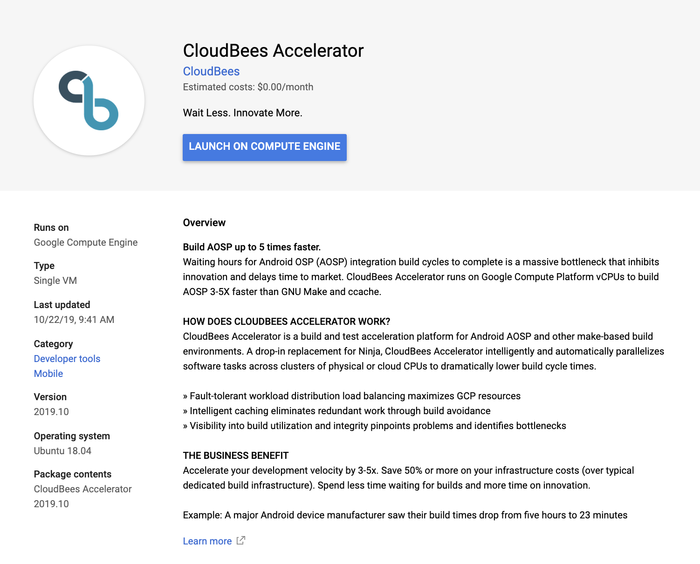
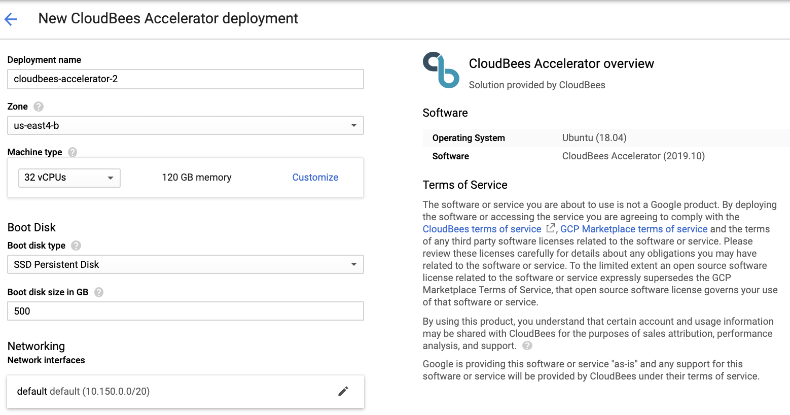
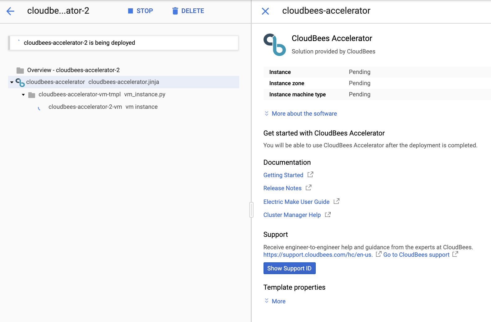
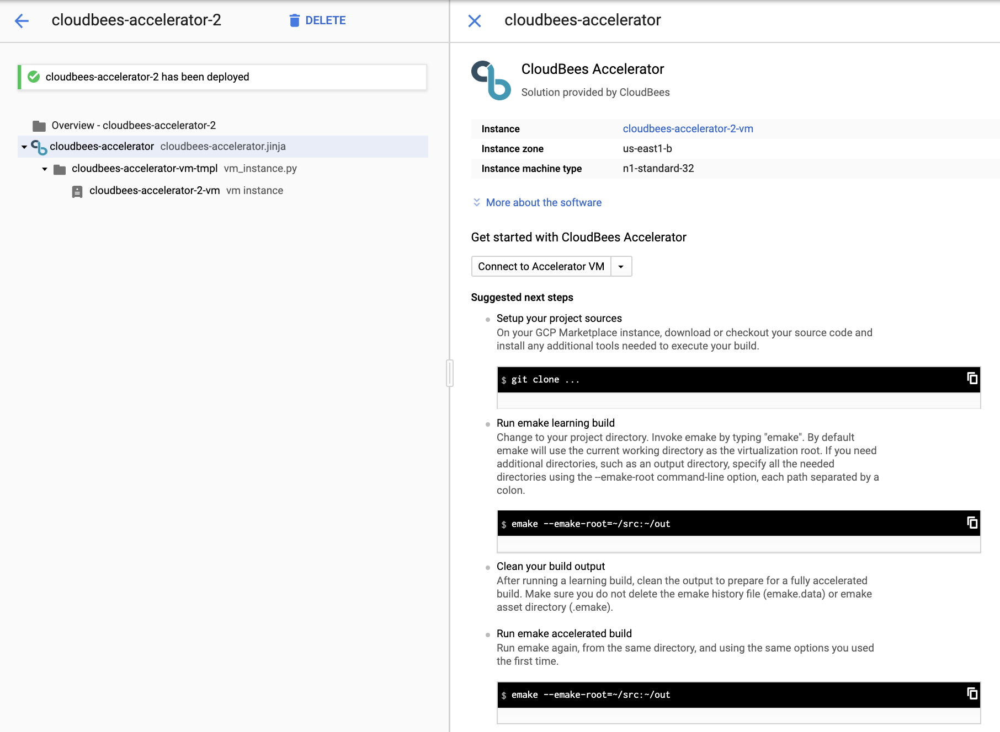
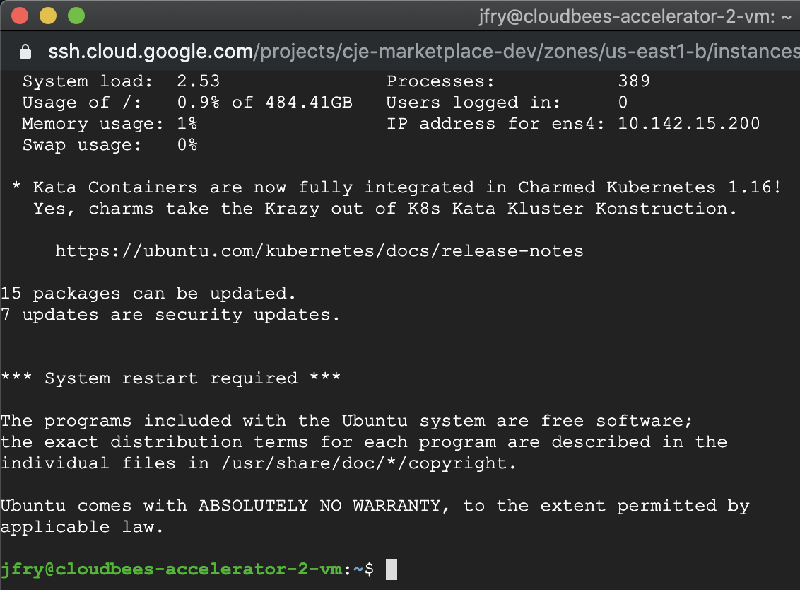

# Getting Started with CloudBees Accelerator on GCP Marketplace

## What is CloudBees Accelerator®?

CloudBees Accelerator (“Accelerator”) from CloudBees, Inc. is a high-performance, drop-in replacement for GNU Make and Ninja build facilities that dramatically reduces software build times. Unlike other parallel build tools, Accelerator guarantees that builds will not fail because of incomplete dependencies, thanks to patented conflict detection and correction algorithms. So your build results—including the build log—are identical to those from serial builds, but they happen with the speed of parallel builds by distributing them over numerous inexpensive machines on a LAN or a public cloud such as Google Cloud Platform. You can also use Accelerator to accelerate static analysis (such as the Coverity, Klocwork, and Parasoft tools), unit testing, and linting tasks.

Accelerator has two primary user-facing parts: Electric Make (”eMake”)—the command-line front end to the cluster, and the Cluster Manager web UI—a web-based dashboard for managing the cluster and viewing various types of cluster activity. In most cases, switching from another build tool to Accelerator is as easy as replacing `make` with `emake`.

## How Do I Deploy Accelerator from GCP Marketplace?

1. Launch Accelerator on Compute Engine.

    Visit the [CloudBees Accelerator marketplace solution page](https://console.cloud.google.com/marketplace/details/cloudbees/cloudbees-accelerator) and click the **LAUNCH ON COMPUTE ENGINE** button:



2. Choose your parameters for deploying Accelerator.

    Specify your deployment name, zone, and machine parameters. The recommended machine for the best performance is an n1-standard-32 (32 vCPUs, 120GB RAM) and a 500 GB persistent SSD:

    

3. Deploy Accelerator.

    Click the **Deploy** button and wait for the deployment to complete. This will take a few minutes:

    

4. Proceed to the next section when the deployment is complete:

    

## How Do I Run My First Accelerator Build?

1. Connect to your Accelerator VM.

    Use the **Connect to Accelerator VM** button to open a Cloud Shell terminal to your VM:

    

2. Set up your project resources.

    On your GCP Marketplace instance, download or check out your source code and install any additional tools needed to execute your build:

```
    git clone [<options>] <repository> [<directory>]
```

3. Run an eMake "learning" build.

    Change to your project directory and invoke eMake by entering `emake`. 
    
    By default, eMake virtualizes just the current working directory across the Accelerator build cluster. If your source code, output files, and build tools are in different directories, specify those directories by adding the `--emake-root=<path1>:<path2> … :<pathN>` option. For example, enter:

```
    emake --emake-root=/home/bill/proj_q3:/src/foo:/src/baz
```
    A message `Starting build: <build_number>` appears. When the build is finished, a message such as the following message appears:
```
    Finished build: 1 Duration: 0:41 (m:s) Cluster availability: 100%

    Cluster availability: 100% indicates that the cluster was fully available for the build duration.
```
4. Clean your build output tree.

    Clean the output (for example, by using `make clean`) to prepare for a fully accelerated build. Do not delete the eMake history file (`emake.data`) or the eMake asset directory (`.emake`).

5. Run an eMake accelerated build.

    Run eMake again, from the same directory, and using the same options you used the first time:

```
    emake --emake-root=/home/bill/proj_q3:/src/foo:/src/baz
```

## How Do I See Data About Builds and Users?

Sign in to the Cluster Manager web UI at `https://<server_hostname_or_IP>/` using the default administrator user name `admin` and password `changeme`. You should change the default password as soon as possible. (If the Cluster Manager web server does not use port 443, append `:<port>` to the host name or IP address.) 

A security warning appears because of an invalid certificate. You should replace the self-signed Apache certificate with one that is signed by a certificate authority.

Then, for

- links to documentation and other assistance, instruction for novice users, and real-time charts for agent usage and build durations, click the **Home** tab.

- a list of builds and other build information, click the **Builds** tab.

- a list of agents participating in builds and information about those agents, click the **Agents** tab.

- reports using many types of analytics about your build cluster and several types of data visualization such as scatter plots and pie charts, click the **Reports** tab.

- messages from the Cluster Manager, agents, and eMake, click the **Messages** tab.

- status for Azure Services Platform, Amazon EC2, Google Cloud Platform, or Kubernetes instances that are active (that is, instances that are running builds), click the **Cloud** tab.

- details about users, click the **Administration** tab.

You might need to open the Cluster Manager web server port by configuring the port number in the firewall rules for your GCP Compute Engine VM instance. For details, see https://cloud.google.com/vpc/docs/vpc?hl=en_US#firewall_rules.

## How Do I Get More Information?

For basic Accelerator terms and concepts, explanations of the relationships among the parts of Accelerator, and more information about the Cluster Manager web UI, see the _Terms and Concepts_ document at http://docs.electric-cloud.com/accelerator_doc/AcceleratorIndex.html. For configuration procedures, see the _CloudBees Accelerator Installation and Configuration Guide_ at http://docs.electric-cloud.com/accelerator_doc/AcceleratorIndex.html. For details about eMake, see the _CloudBees Accelerator Electric Make User Guide_ at http://docs.electric-cloud.com/accelerator_doc/AcceleratorIndex.html.

## How Do I Get Help?

For technical support, call +1 408.419.4300, send email to accel-support@cloudbees.com, or go to https://support.cloudbees.com/hc/en-us/categories/360002059512/ to submit a support request. You can also go to https://ask.cloudbees.com/ —a member-moderated community forum where you can ask and answer questions as well as comment on (and vote for) the questions of others and their answers.
